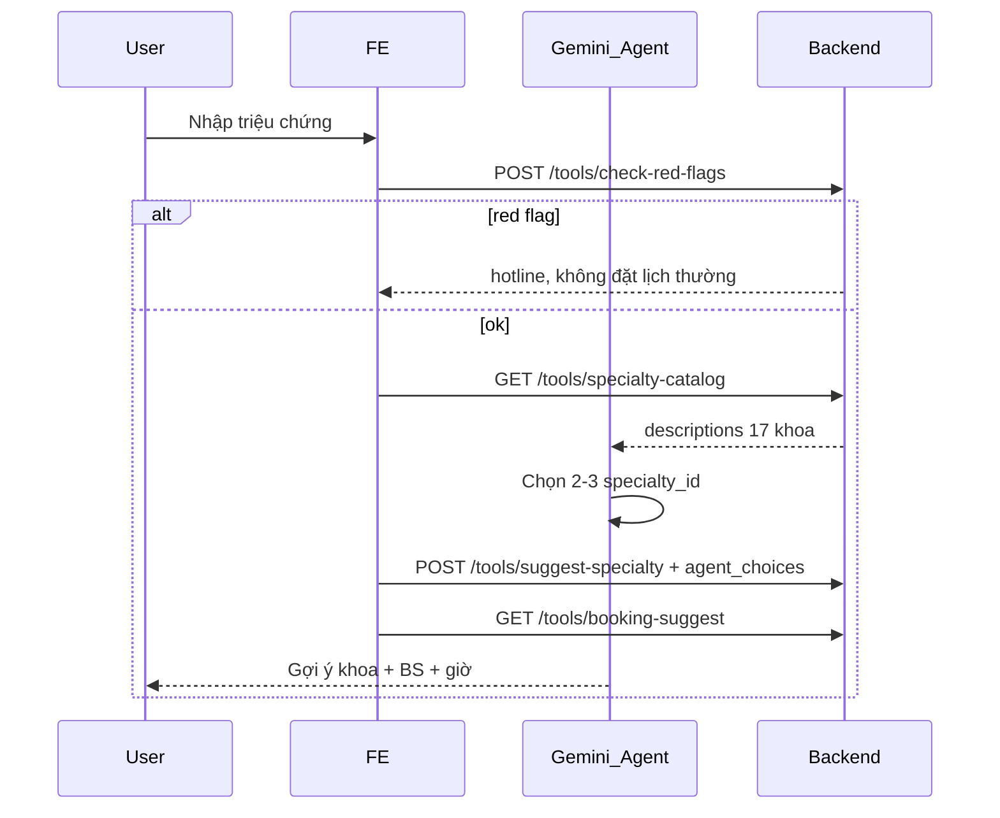

# VinmecCare API — Hướng dẫn FE & Agent

Base URL (local): `http://127.0.0.1:8000`

OpenAPI tự động: `http://127.0.0.1:8000/docs`

---

## 1. Ranh giới privacy (bắt buộc đọc)

| Dữ liệu | Được gửi vào LLM? | API dùng |
|---------|-------------------|----------|
| Triệu chứng, tuổi, cơ sở mong muốn | Có (qua agent Đạt) | `/tools/*` |
| Họ tên, SĐT, email, ngày sinh | **Không** | `/bookings` only |
| Chọn khoa / BS / slot trên form | Không cần LLM | `/form/*` |

**FE submit PII:** luôn `POST /bookings` — không đưa PII vào body `/tools/*`.

---

## 2. Ai gọi API nào?

```text
┌─────────────┐     /tools/*      ┌──────────────┐
│ Agent Đạt   │ ────────────────► │ Backend      │
│ (Gemini)    │   triệu chứng     │   :8000      │
└─────────────┘                   └──────┬───────┘
                                         │
┌─────────────┐     /form/*            │ /bookings
│ FE Quân     │ ───────────────────────┤ (PII)
│ Chat + Form │                        │
└─────────────┘                        ▼
                                 data/bookings.csv
```

| Nhóm route | Người dùng | Mục đích |
|------------|------------|----------|
| `/tools/*` | **Agent** (Đạt) | Khoa, red flag, gợi ý BS/slot trong chat |
| `/form/*` | **FE** (Quân) | Dropdown cascade, enable/disable option |
| `/bookings` | **FE** (Quân/Nam) | Submit & xem lịch, sửa liên hệ |

---

## 3. Luồng Agent (Đạt) — gợi ý trong chat



### Bước chi tiết

1. `POST /tools/check-red-flags` — luôn chạy trước.
2. `GET /tools/specialty-catalog` — inject `prompt_block` vào system prompt.
3. Gemini trả `agent_choices`: `[{ specialty_id, reason }, ...]`.
4. `POST /tools/suggest-specialty` — validate id từ CSV.
5. `GET /tools/booking-suggest?specialty_id=&facility_id=` — hoặc tách `doctors` + `available-slots`.
6. Handoff sang form: truyền `specialty_id`, `facility_id`, `doctor_id`, `slot_id`, `symptom_summary` (không PII).

### Import Python trực tiếp (không HTTP)

```python
from src.tools.medical import (
    check_red_flags,
    get_specialty_catalog,
    format_specialty_catalog_for_prompt,
    suggest_specialty,
    list_facilities_for_specialty,
    list_doctors_by_specialty,
    get_available_slots,
    suggest_booking_package,
)
```

---

## 4. Luồng FE (Quân) — form & đặt lịch

```text
1. GET /form/booking-context?specialty_id=...     → facilities
2. User chọn cơ sở
3. GET /form/booking-context?specialty_id=...&facility_id=times_city
   → doctors (selectable) + slots_by_doctor
4. User chọn BS + slot (chỉ option selectable=true)
5. User nhập PII trên form
6. POST /bookings
7. Tab lịch: GET /bookings
8. Sửa SĐT: PATCH /bookings/{ticket_id}
```

---

## 5. API Reference

### 5.1 Health

`GET /health`

```json
{ "status": "ok" }
```

---

### 5.2 Tool A — Triệu chứng & chuyên khoa (Agent)

#### `GET /tools/specialty-catalog`

Catalog cho Gemini (không có `cap_cuu` trong gợi ý đặt lịch thường).

**Response:**

```json
{
  "specialties": [
    {
      "specialty_id": "tieu_hoa_gan_mat",
      "name": "Tiêu hoá - Gan mật",
      "description": "..."
    }
  ],
  "prompt_block": "Danh sách chuyên khoa..."
}
```

**Hàm:** `get_specialty_catalog()`, `format_specialty_catalog_for_prompt()`

---

#### `POST /tools/check-red-flags`

**Body:** `{ "text": "Tôi đau ngực dữ dội, khó thở" }`

**Response:**

```json
{
  "is_red_flag": true,
  "message": "...",
  "hotline": "1900 232389",
  "matched_keywords": ["đau ngực", "khó thở"]
}
```

Nếu `is_red_flag: true` → không gọi suggest booking thường; hiện hotline / callback.

**Hàm:** `check_red_flags(text)`

---

#### `POST /tools/suggest-specialty`

**Body (bước 1 — lấy catalog cho agent):**

```json
{
  "symptom_summary": "Đau bụng âm ỉ 2 ngày, tiêu chảy"
}
```

**Response:** `routing_mode: "agent"`, `specialty_catalog: [...]`, `suggested_specialties: []`

**Body (bước 2 — sau khi Gemini chọn):**

```json
{
  "symptom_summary": "Đau bụng âm ỉ 2 ngày",
  "agent_choices": [
    { "specialty_id": "tieu_hoa_gan_mat", "reason": "Triệu chứng tiêu hóa" }
  ]
}
```

**Response:** `routing_mode: "agent_validated"`, `suggested_specialties: [{ specialty_id, name, reason, score }]`

**Hàm:** `suggest_specialty(symptom_summary, agent_choices=None)`

---

### 5.3 Tool B — Gợi ý đặt lịch (Agent)

#### `GET /tools/facilities?specialty_id={id}`

Cơ sở có ít nhất 1 bác sĩ thuộc khoa đó.

**Hàm:** `list_facilities_for_specialty(specialty_id)`

---

#### `GET /tools/doctors?specialty_id={id}&facility_id={id?}`

| Field | Ý nghĩa |
|-------|---------|
| `availability_status` | `available` \| `full` |
| `has_open_slot` | Còn ít nhất 1 slot trống |
| `needs_check` | `available` nhưng không phải full slot (1/3 còn) |
| `open_slot_count` | Số slot trống |

Agent: ưu tiên BS `has_open_slot`, bỏ qua `full`.

**Hàm:** `list_doctors_by_specialty(specialty_id, facility_id=None)`

---

#### `POST /tools/available-slots`

**Chỉ slot trống** — dùng agent gợi ý giờ khám.

**Body:**

```json
{
  "specialty_id": "tim_mach",
  "facility_id": "times_city",
  "doctor_id": "bs_tim_mach_01"
}
```

**Response:**

```json
{
  "specialty_id": "tim_mach",
  "facility_id": "times_city",
  "doctor_id": "bs_tim_mach_01",
  "slots": [
    {
      "slot_id": "slot_tim_mach_01_01",
      "date": "2026-06-05",
      "time": "14:00",
      "available": true
    }
  ]
}
```

**Hàm:** `get_available_slots(specialty_id, facility_id=None, doctor_id=None)`

---

#### `GET /tools/booking-suggest?specialty_id={id}&facility_id={id?}`

Gói một lần: `facilities`, `doctors`, `recommended_slots` (slot trống).

**Hàm:** `suggest_booking_package(specialty_id, facility_id=None)`

---

### 5.4 Form — FE chỉnh tay (không LLM)

#### `GET /form/booking-context`

Query: `specialty_id` (bắt buộc), `facility_id?`, `doctor_id?`, `slot_id?`

**Khi chỉ có specialty_id:** trả `facilities`, `doctors: []`, `slots_by_doctor: {}`.

**Khi có facility_id:** trả `doctors` **chỉ thuộc cơ sở đó** + `slots_by_doctor` (mọi slot, kể cả đã kín).

**Doctor option:**

```json
{
  "doctor_id": "bs_tim_mach_02",
  "name": "BS. ...",
  "availability_status": "full",
  "selectable": false,
  "disabled_reason": "Bác sĩ đã hết lịch",
  "needs_check": false
}
```

**Slot option:**

```json
{
  "slot_id": "slot_tim_mach_03_02",
  "date": "2026-06-06",
  "time": "10:30",
  "available": false,
  "selectable": false
}
```

**FE rule:** Chỉ cho chọn khi `selectable === true`. Đổi `facility_id` → gọi lại endpoint với `facility_id` mới.

**Hàm:** `get_booking_form_context(specialty_id, facility_id=..., doctor_id=..., slot_id=...)`

**Tách nhỏ (tùy chọn):**

- `GET /form/facilities?specialty_id=`
- `GET /form/doctors?specialty_id=&facility_id=` (facility bắt buộc)
- `GET /form/slots?specialty_id=&facility_id=&doctor_id=`

---

### 5.5 Bookings — PII (FE only)

#### `POST /bookings`

**Body:**

```json
{
  "name": "Nguyễn Văn A",
  "phone": "0901234567",
  "email": "a@example.com",
  "dob": "1995-06-01",
  "facility_id": "times_city",
  "specialty_id": "tim_mach",
  "doctor_id": "bs_tim_mach_03",
  "slot_id": "slot_tim_mach_03_01",
  "symptom_summary": "Đau ngực âm ỉ",
  "status": "confirmed",
  "notes": ""
}
```

| status | ticket_id prefix |
|--------|------------------|
| `confirmed` | `VMC-YYYYMMDD-####` |
| `callback` | `CALLBACK-YYYYMMDD-####` |
| Khác | `draft`, `pending_review`, `cancelled` |

**Success 200:**

```json
{
  "ok": true,
  "ticket_id": "VMC-20260605-0001",
  "booking": { "...": "..." },
  "message": "Đặt lịch thành công"
}
```

**Error 400:** slot đã kín, id không hợp lệ, thiếu name/phone.

Sau `confirmed`: slot tương ứng trong `slots.csv` → `available=false`.

**Hàm:** `submit_booking(data)`

---

#### `GET /bookings`

Query: `phone?`, `status?`

**Response:**

```json
{
  "bookings": [
    {
      "ticket_id": "VMC-20260605-0001",
      "name": "...",
      "phone": "...",
      "facility_name": "Vinmec Times City",
      "specialty_name": "Trung tâm Tim mạch",
      "doctor_name": "BS. ...",
      "slot_date": "2026-06-05",
      "slot_time": "14:00",
      "status": "confirmed"
    }
  ]
}
```

**Hàm:** `list_bookings(phone=None, status=None)`

---

#### `GET /bookings/{ticket_id}`

Chi tiết một ticket (đã enrich tên cơ sở/khoa/BS).

**Hàm:** `get_booking(ticket_id)`

---

#### `PATCH /bookings/{ticket_id}`

Chỉ sửa: `name`, `phone`, `email`, `dob`, `notes`.

**Body ví dụ:**

```json
{ "phone": "0909999888", "email": "new@example.com" }
```

**Hàm:** `update_booking(ticket_id, patch)`

---

## 6. Quan hệ dữ liệu (CSV)

```text
facilities (facility_id)
    ↑
doctors (doctor_id, specialty_id, facility_id, availability_status)
    ↑
slots (slot_id, facility_id, specialty_id, doctor_id, available)
    ↑
bookings (ticket_id + PII + các *_id)
```

**Cascade form:** `facility_id` → lọc `doctors` → `slots_by_doctor[doctor_id]`.

---

## 7. Ví dụ fetch (FE)

```javascript
const API = "http://127.0.0.1:8000";

// Form cascade
const ctx = await fetch(
  `${API}/form/booking-context?specialty_id=tim_mach&facility_id=times_city`
).then((r) => r.json());

// Submit — không qua agent
const res = await fetch(`${API}/bookings`, {
  method: "POST",
  headers: { "Content-Type": "application/json" },
  body: JSON.stringify({
    name: form.name,
    phone: form.phone,
    email: form.email,
    dob: form.dob,
    facility_id: form.facility_id,
    specialty_id: form.specialty_id,
    doctor_id: form.doctor_id,
    slot_id: form.slot_id,
    symptom_summary: draft.symptom_summary,
    status: "confirmed",
  }),
}).then((r) => r.json());

// Tab lịch đã đặt
const list = await fetch(`${API}/bookings`).then((r) => r.json());
```

---

## 8. Ví dụ tool call (Agent / Đạt)

```python
# Trong orchestrator sau khi user gửi tin nhắn triệu chứng
red = check_red_flags(user_message)
if red["is_red_flag"]:
    return {"type": "escalation", **red}

catalog = format_specialty_catalog_for_prompt()
# ... gọi Gemini với catalog, nhận agent_choices ...

validated = suggest_specialty(
    symptom_summary,
    agent_choices=[
        {"specialty_id": "tieu_hoa_gan_mat", "reason": "..."},
    ],
)
sid = validated["suggested_specialties"][0]["specialty_id"]
package = suggest_booking_package(sid, facility_id="times_city")
# package["doctors"], package["recommended_slots"] → render chat cards
```

---

## 9. Mã lỗi HTTP

| Code | Khi nào |
|------|---------|
| 400 | Validate booking/form (thiếu field, slot kín, id sai) |
| 404 | `GET /bookings/{ticket_id}` không tồn tại |

---

## 10. Phân công module

| Module | Owner | Path |
|--------|-------|------|
| Medical tools | Đăng Khoa (2A202600922) | `src/tools/medical/` |
| Booking / PII | Hoàng Nam (2A202600870) | `src/tools/booking/` |
| API routes | Chung | `src/api/main.py` |

**Regenerate CSV:** `python scripts/generate_vinmec_data.py`
